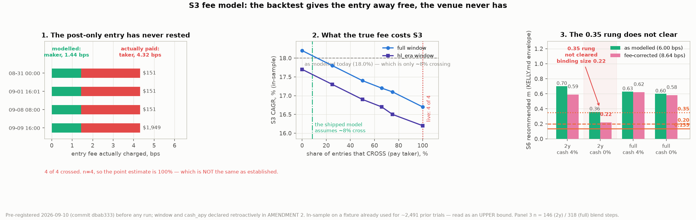

# RESEARCH_FEES.md — does S3's edge survive the fee we actually pay?

Run 2026-09-10 on the committed fixture `bars_4h_btcusd.csv`, research basis
(`RESEARCH_BOOKS` / `RESEARCH_SIGNAL` / `RESEARCH_TRADE`, warmup 210), full
window 2022-01-01 → end plus the HL-era sub-window from 2023-05-12. Grid,
windows, Kelly pipeline and **decision rules** fixed in
`research/fees/PREREG.md`, committed before the first cell was evaluated
(`dbab333`). Two amendments, both written after a counter-agent pass, both
correcting me.

## Verdict

**The 0.35 rung is retired. The ladder stops at 0.20 pending live evidence.**

That is §5's middle row, on a binding S6 recommended m of **0.22**. The
0.135 → 0.20 step clears in every specification tested; 0.35 does not clear
the conservative one.

**Read against the real ramp, this bites harder than §5's wording suggests.**
The pre-registration framed the ladder as `0.135 → 0.20 → 0.35`, but the
staircase in `render.yaml` and EXECUTOR.md runs
`0.05 → 0.10 → 0.20 → 0.35 → 0.56 → ceiling 0.80`. A 0.22 envelope caps it at
**step B**: rung C (0.35), rung D (0.56) and the 0.80 ceiling are all outside
the envelope on this evidence. That extension is an implication, not a
registered rule — §5 only ever fixed the 0.35 boundary — and it is stated
here so the ceiling is not later read as still open.

**This reverses what I first reported.** The first cut said "ladder proceeds
unchanged". It was one un-preregistered cell, reported as though it were the
answer. AMENDMENT 2 is the correction and this document leads with it.

**My registered prior was wrong, and it was wrong in the flattering
direction.** PREREG §3 recorded: *"H3 most likely holds… a ~6% edge haircut
is unlikely to close a 2x gap."* The reasoning failed at the other end: the
CAGR haircut really is small (18.0% → 16.7%, ~7% relative), but the "2x gap"
was never 2x. It was 2x only against KELLY.md's S6 of 0.70, and that 0.70
carries a 4% cash yield the ladder's own books do not earn (see below). With
`cash_apy=0`, the pre-fee envelope on the same window is **0.36** — the
0.35 rung was already sitting inside its own margin of error before any fee
was corrected. The fee then takes it to 0.22. Recording the prior is what
makes that visible.

## The measurement (H1): real, and small in return terms

`hl.place_limit` sends `tif=Alo`, the venue rejects it as marketable, and the
except branch re-sends `tif=Gtc` priced into the market. **Four of four
intended-maker pullback entries crossed and paid taker.** True round trip
**8.64 bps** (4.32 in + 4.32 out) against a modelled 6.00 — the net of two
errors pointing opposite ways (entry given away free, exit overcharged).

S3, full window, across the registered dose curve:

| entries crossing | fee bps | CAGR | total return | MTM max DD | fees paid |
|---|---:|---:|---:|---:|---:|
| baseline (as modelled) | 6.00 | 18.0% | 107.9% | −22.19% | $17,290 |
| 0% | 5.76 | 18.2% | 108.8% | −22.13% | $16,640 |
| 66% (backtest estimate) | 7.66 | 17.2% | 101.4% | −22.62% | $21,698 |
| **100% (live observation)** | **8.64** | **16.7%** | **97.7%** | **−22.87%** | **$24,225** |

The shipped 6.00 model is more optimistic than it looks: priced against the
correct 1.44-bps maker leg, 6.00 corresponds to only **~8% of entries
crossing** (`(6.00−5.76)/2.88`), not the ~39% the first chart implied.

HL-era window, same shape: 17.5% → 16.2% CAGR. Win rate is **unmoved** (63.2%
full / 63.8% HL-era at every fee level) — the fee does not change which trades
win, only what they keep. Profit factor 1.30 → 1.28. 190 trades full, 141
HL-era, identical in every arm, which is the check that the corrected run
differs from baseline *only* through the fee channel.

**The kill rule did not fire.** S3's non-positive-resample share is 0.6–1.1%
(full) and 6.3–7.6% (2y) against a 25% bar. The pullback book is not in
question; its *size* is.

## The sizing question (H2/H3): the answer depends on the specification

This is the part that matters, and the part I got wrong first. The Kelly
re-fit needs a window and a `cash_apy`, and PREREG §4.4 fixed neither. All
four cells, S6 recommended m:

| cell | n | as modelled | fee-corrected | fee effect | §5 decision |
|---|---:|---:|---:|---:|---|
| 2y, cash 4% | 146 | 0.70 | 0.59 | −15.7% | proceed unchanged |
| **2y, cash 0%** | 146 | 0.36 | **0.22** | **−38.9%** | **retire the 0.35 rung** |
| full, cash 4% | 318 | 0.63 | 0.62 | −1.6% | proceed unchanged |
| full, cash 0% | 318 | 0.60 | 0.58 | −3.3% | proceed unchanged |

S5 for reference: 0.94→0.79, 0.48→0.30, 0.85→0.83, 0.80→0.78.

**The fee effect is not window-stable: −1.6% to −38.9%.** The first cut
reported −3.4% as if it were a property of the correction. It is a property
of one cell.

### Harness validation, which §7 asked for and the first cut skipped

The 2y/cash 4% cell reproduces KELLY.md's published table exactly — S3 0.60,
S4 killed at 0.00, S6 0.70, n = 88 / 58 / 146. That is KELLY.md's own config,
so the harness is the shipped pipeline and not a lookalike.

### Why three cells saying "proceed" does not outvote one saying "stop"

1. **`cash_apy=0.00` is the more defensible setting, not the flattering one.**
   It is `run_replay`'s default and the research-basis convention. Per
   AMENDMENT 2 the 0.04 variants credit the blend with a cash yield the
   single books never get.
2. **KELLY.md's own doctrine**: *"over-betting destroys growth faster than
   under-betting gives it up (the g-curve is asymmetric), so the conservative
   envelope is the honest size."* When defensible specifications disagree
   about size, the smaller one governs. That rule was already in the repo,
   written for exactly this case.

## The `cash_apy` finding, which was not what this study went looking for

The first cut explained 0.59 vs KELLY.md's 0.70 as a window difference. It is
not. Decomposed:

| step | S6 rec |
|---|---|
| 2y, cash 4%, shipped steps — KELLY.md's config | 0.70 |
| same window, cash **0%** | 0.36 |
| full window, cash 0% | 0.60 |
| full window, cash 0%, first cut's own blend steps | 0.59 |

`cash_apy` moves S6 by **−0.34 on the same window**; the window moves it back
**+0.24**. They happen to net to the −0.11 I attributed wholly to "window". A
near-cancellation of two large effects is not a window difference.

**Mechanism.** Per-trade streams are immune to idle-cash accrual, which lands
between trades. Blend steps are built from `equity_after / start_equity`, so
they capture it in the gaps. **KELLY.md's S5/S6 rows therefore carry a 4% cash
yield that its own S1–S4 rows do not.** That is a shipped-pipeline
inconsistency, inherited here and now named. It is the same object as
RESEARCH_PROTOCOL §9 backlog item 1 (cash-yield modelling), which turns out to
be half-implemented rather than absent.

Separately: the first cut rebuilt blend steps from `blend_curve`'s NAV as
`nav[i]/nav[i-1]-1`, which silently drops the first step (n=317 vs 318) and
the dropped element was favourable. `refit_kelly.py` now replicates
`main.py:501-513` verbatim.

## Counter-agent panel (CLAUDE.md mandatory)

Two passes. Both overturned something I had already written down as fact.

| pass | verdict |
|---|---|
| 1 · fee arithmetic | **The maker leg was priced at ZERO. It is 1.44 bps** (`userAddRate` 0.00015, same 4% referral discount that gives 4.32). I verified it myself against `userFees` rather than taking the finding on trust. AMENDMENT 1. |
| 2 · Kelly re-fit | **Struck the headline.** Window and `cash_apy` were never registered; "different window" was the wrong mechanism; the blend steps were not the shipped ones; and one cell had been reported as the result. AMENDMENT 2. |

The first pass also found that three books were corrected, not one (S3 flows
into S5/S6), and that the study's §2 arithmetic had used `TAKER` where the
frozen text said `HL_TAKER` — both declared rather than quietly fixed.

## What this study spent

- **24 trials, not the 14 declared.** 14 registered grid arms (6 fee levels ×
  2 windows + 2 baseline reruns), plus **8 Kelly re-fits** (4 window/cash
  cells × 2 fee arms) that §4.4 fixed the pipeline for but never enumerated
  as cells, plus **2 post-hoc Kelly re-fits at the registered 0.66 fee level**
  for the robustness check in the honesty box. Counted honestly; registry
  updated.
- **No holdout was burned.** Nothing here searched signal space and no
  parameter other than `fee_bps` moved, so §7 and §8 are untouched. The
  action taken is a *reduction* in size, which §8's tie-break already favours.
- Every number is in-sample on a fixture now carrying ~2,515 prior trials.
  Read as an **upper bound** per protocol §2.

## Honesty box

- **Frozen numbers.** Grid: `research/fees/grid.json`. Kelly: `kelly_refit.json`.
  Console: `results.2026-09-10.txt`. Runners: `run_grid.py`, `refit_kelly.py`.
- **n = 4.** Four-for-four crossing is consistent with a true rejection rate
  anywhere above ~40% at 95% confidence. The point estimate is 100%; that is
  **not** the same as established. The 0.66 cell is registered precisely so
  the conclusion does not rest on the 1.00 cell alone, and **it does not**:
  re-fitting the binding cell at the registered 0.66 level (7.66 bps) gives
  S6 **0.27** — still inside §5's 0.20–0.35 band, same decision. The verdict
  survives dropping the live crossing rate from 100% to 66%. (That re-fit is
  post-hoc as a *Kelly* cell; the fee level itself was registered. Logged in
  the trial count.)
- **Trade-close (exit-step) basis** for CAGR and Kelly; MTM drawdowns run
  ~1pp deeper and are reported alongside.
- **In-sample.** No out-of-sample evidence exists for any number here.
- **S5/S6 still charge the donchian leg 12.0 bps** while the venue charges
  4.32 taker. In scope per §8 (only `fee_bps` may move) and it biases the
  blends *conservative*, but the blend rows are therefore not a clean
  "live fee" measurement. A full-venue-fee blend is separate work.
- **The pullback fee is now a literal, not config-tracking.** `_process_
  pullback` gets an explicit `fee_bps`; `research_basis_stats` carries a third
  independent fee expression. Three places to keep in sync where there should
  be one. Recorded in AMENDMENT A1.5, not fixed here.
- **An unmeasured offset, flagged not modelled.** When the Alo rejection
  re-prices into the market, the fill can land *better* than the intended
  limit, partly offsetting the 4.32. Sizing it needs the live engine's pending
  limit for those four `signal_ts`, which we do not have. Per CLAUDE.md that
  is an input to request, not to model around — so the reported cost is an
  **upper bound on the fee channel alone**.
- **The dropped-first-exit defect** (`bench_blend.py:46-48`) is still present
  in every published S5/S6 number in this repo, including these. Protocol §9
  item 6.
- **Not an execution fix.** That the post-only never rests is a separate,
  actionable engineering question worth roughly **$30/yr** — the
  pre-registration's $45/yr was computed against a 0-bps counterfactual and
  the real saving is `4.32 − 1.44 = 2.88` bps (AMENDMENT A1.1). Even that
  ignores that entries which then rest may never fill at all, which is a
  selection effect, not a fee change. Tracked apart from this and deliberately
  not bundled into the conclusion.

## What follows from this

1. **The ramp stops at step B (0.20).** Rung C (0.35) is retired pending live
   evidence, not deleted from history; D (0.56) and the 0.80 ceiling were
   already beyond it and stay closed.
2. Live `KELLY_M` is 0.135 and **does not change today** — it is a
   venue-mechanics floor (the $10 `MinTradeNtl`), deliberately off the
   staircase, and it sits under the 0.22 envelope. This study bounds where
   the ramp is allowed to go, not where it is.
3. EXECUTOR.md's ramp table is not edited here. Changing the live schedule is
   Casey's call, not a research output; this document is the evidence for it.
4. The `cash_apy` inconsistency in the shipped Kelly pipeline is now the
   highest-value open item this study produced, and it is not a fee question.
