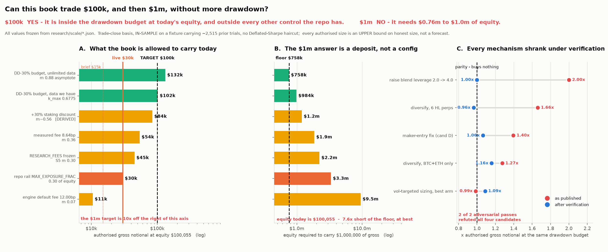

# RESEARCH_SCALE.md — how big can this book trade, and what actually stops it?

Run 2026-09-28. Four measurement lanes (risk-per-trade, capital envelope, edge
headroom, liquidity stress) and four build candidates (vol-targeted sizing,
rails-as-fractions, multi-perp diversification, execution/carry), each candidate
given **two independent adversarial passes that read the real code**. All
scripts and frozen outputs in `research/scale/`. Live venue reads
(`l2Book`, `meta`, `userFees`, `fundingHistory`, `candleSnapshot`) are public
`info` endpoints, no credentials, read-only.



## Verdict

**$1m of gross notional on ~$100k of equity at constant drawdown: NO.** It is
10.0x equity. The hardest measured ceiling on gross/equity is **1.32x** — the
P(maxDD>30%) <= 10% budget with unlimited data, the one term more data cannot
move. $1m therefore needs **$757,576 of equity at the absolute floor**,
**$905,797–$984,010 on the data we actually have**, and $1.85m–$3.33m on the
conservative cells. No mechanism in this study moves that number by more than
~20%, and the one that claimed to move it 40% was refuted to zero. **$1m is a
funding plan, not a strategy question.**

**$100k of gross notional: YES on drawdown, NO on everything else.** $100,000 is
0.9995x equity, which is inside the measured 30%-drawdown budget on all three
independent reads ($101,681 / $110,461 / $132,073) — by 1.7% on the tightest. It
is also:

- **3.33x** past the repo's own `MAX_EXPOSURE_FRAC` 0.30 rail;
- **1.85x** past the largest size the repo's own Kelly instrument authorises on
  the measured fee basis ($54,030), and **9.5x** past it on the engine's
  registered default ($10,506);
- past the point where the **drawdown breaker can physically fire**. `DD_HALT_PCT`
  is 0.35 **of base**, so the halt threshold is 1.1667x gross. Above gross
  **$68,609** it exceeds 80% of the account and guard 1 WARNs; above gross
  **$85,761** it exceeds the whole account and the breaker can never fire before
  wipeout. Both are *below* the $100k target. Both are `WARN`, not a block.

So: reaching $100k means sizing on the drawdown criterion alone and discarding
the estimation-error criterion, then rebuilding the halt rails on equity.
KELLY.md's own doctrine says the smaller of two defensible specifications
governs. **That is a policy decision, and it is Casey's, not a measurement.**

**Casey's premise is correct and was re-measured three independent ways.** At
fixed k, drawdown *percentage* is invariant to dollar scale: fixed-fraction
sizing returns mult 1.135918622 and maxDD -2.416873% identically at $100,055 and
$10m of equity; bootstrap median maxDD by k is unchanged by the dollar level.
Nothing here re-argues it. What raises drawdown is raising **k**, not raising
notional — and what caps k is capital, then edge.

---

## 0. Read this first — the live config moved under the study

Every phase-1 and phase-2 number was computed against `SIZING_BASE_USD` 50,000 /
`MAX_NOTIONAL_USD` 20,000 / gross $15,000. **`render.yaml` commit `76dfb08`,
dated today 2026-09-28 18:16, records a different live config:**

```
Current dashboard values (2026-09-28, Hyperliquid live phase):
KELLY_M 0.20, SIZING_BASE_USD 100000, MAX_NOTIONAL_USD 40000,
MAX_ACCOUNT_LEV 2.0, DD_HALT_PCT 0.35
```

| | task brief ("live-B") | render.yaml 76dfb08 ("live-A") |
|---|---:|---:|
| `SIZING_BASE_USD` | 50,000 | 100,000 |
| `MAX_NOTIONAL_USD` | 20,000 | 40,000 |
| gross deployed | $15,000 | **$30,000** |
| gross / equity | 0.1499 | **0.2998** |
| effective k (`gross/(lev*equity)`) | 0.0999 | **0.1999** |
| DD halt (0.35 x base) | $17,500 = 17.5% of equity | **$35,000 = 35.0%** |
| daily-loss halt | $3,000 = 3.0% | **$6,000 = 6.0%** |

All five keys are `sync: false`, so **neither file is authoritative — the Render
dashboard is**, and the committed `btc-executor/data/executor_state.json` is a Coinbase-era
placeholder (`last_dry_run: true`, all zeros) that resolves nothing. Per the
ASK rule this is not modelled around: **it is P1 question 1**, and it flips the
sign of the headline recommendation.

**If live-A is real — and the commit is dated today and titled "record the 2x
base step" — then the single biggest item every lane found is already spent.**
Phase 1's "free 2.001x" (`SIZING_BASE_USD` is half of equity, so the book runs
at k 0.0999 while `KELLY_M` reads 0.20) has been taken. The book now sits:

- **exactly on `MAX_EXPOSURE_FRAC` 0.30** — the repo's own stated full Kelly
  envelope, expressed as a fraction of capital;
- **exactly on rung B (`KELLY_M` 0.20)**, which EXECUTOR.md calls **THE
  CEILING** and the last rung that exists; C, D and the 0.80 ceiling are retired;
- at **67% of `RESEARCH_FEES.md`'s own frozen authorisation** (S5 m 0.30 x lev
  1.5 x equity = $45,025). Note that the ladder's 0.20-vs-0.30 comparison is
  only units-correct when `base == equity`; at base 50,000 the book was at 33%
  of that authorisation, not 67%, and the ladder read it as 67%. The 2x step
  accidentally made the comparison honest.

There is no more free size. Everything above rung B is a repo change plus review
by the ladder's own construction, and **two consecutive steps (09-21 to 0.20,
09-28 to base 100,000) were taken with the ramp's cumulative-P&L gate NOT met**
(-$12.11 gross / -$22.03 net at the 09-21 step), with tripwires substituted.
That is recorded in `render.yaml` and is not a criticism — it is the reason the
next step needs an evidence gate rather than another tripwire.

**One correction to a candidate recommendation, from the same file.** Candidate B
proposes `DD_HALT_PCT` 0.35 -> 0.175. `render.yaml` records that exact proposal
being raised and rejected: *"Lowering it to 0.175 — which was briefly proposed —
would have TIGHTENED risk relative to the book rather than holding it constant,
and Casey caught that."* That rejection is Casey's own proportionality premise,
correctly applied. Do not re-propose it.

---

## 1. The ceiling ladder — every number that claims to bound size

Equity $100,055 (the capital lane read $100,020.91; the $34 is immaterial).
`gross = KELLY_M x REFERENCE_LEV(1.5) x base`, so gross/equity is the one
comparable unit. Authorised gross = `recommended_m x 1.5 x equity`.

| ceiling | gross/equity | gross today | equity for $100k | equity for $1m | source |
|---|---:|---:|---:|---:|---|
| engine registered fee 12.00 bp, m 0.07 | 0.105 | $10,506 | $952,381 | $9,523,810 | `fee_axis.json` |
| **live-A (render.yaml 09-28)** | **0.2998** | **$30,000** | — | — | `render.yaml:596` |
| repo rail `MAX_EXPOSURE_FRAC` | 0.300 | $30,016 | $333,333 | $3,333,333 | `mirror.py:86` |
| RESEARCH_FEES frozen S5 m 0.30 | 0.450 | $45,025 | $222,222 | $2,222,222 | `RESEARCH_FEES.md` §5 |
| measured fee 8.64 bp, m 0.36 | 0.540 | $54,030 | $185,185 | $1,851,852 | `fee_axis.json` |
| +30% staking discount, m~0.56 *[derived]* | 0.840 | $84,046 | $119,048 | $1,190,476 | `fee_axis` + `userFees` |
| **DD-30% budget, data we have** (k_max 0.6775) | **1.0162** | **$101,681** | **$98,401** | **$984,010** | `ladder_findings.json` |
| DD-30% budget, HL bars, BTC alone, halts off | 1.104 | $110,461 | $90,580 | $905,797 | candC refutation |
| **DD-30% budget, unlimited data** (m 0.88) | **1.320** | **$132,073** | **$75,758** | **$757,576** | `nscale.json` |
| Hyperliquid margin (BTC 40x tier-1, maint 1.25%) | 40.0 | $4,000,836 | — | — | `liq.json` |

Reading it:

- **Market impact is not on this list because it is not a constraint.** 440 live
  book samples: $1m round trip **1.97 bp median, 8.67 bp worst** — inside the
  8.64 bp taker fee the book already pays. First hard venue bound is HL's **$30m
  max market order**, 30x the target. Position limit: N/A. $1m is 0.032% of the
  $3.165bn open interest. *Do not spend another hour here.*
- **Liquidation is not the binder either, if the DD budget is respected.**
  Liquidation distance equals the p99 5xATR chandelier stop at **4.96x equity**;
  the DD budget binds at ~1.1x. The DD budget binds first by 4.5x.
- **Two windows disagree by 3.6x and the gap IS the answer.** Full sample
  (n=318) rates live-B undersized >=2x (recommended_m 2.00, truncated by
  `kelly.M_CAP` so it is a floor). The 2024-07 single-touch holdout (n=151) rates
  it **OVERSIZED** at recommended_m 0.55 = $8,250. `RESEARCH_TRAIL.md`'s window
  map calls 2024-07 (`modern_B`) the only OOS window and its precedent defers to
  it. On the holdout read, **live-A at $30,000 is 3.6x over.**
- **The binding term is not drawdown — it is the bootstrap p10 of m\*** at
  n=146–151, and that statistic moves **1.79x on the RNG seed alone** (p10
  0.29–0.52 across 12 seeds; shipped seed 20260804 gives 0.36, near the
  conservative end). Seed-only spread in "authorised gross" is $28,516,
  sd $8,621. **Quote ratios, not levels.**

**The exchange rate.** Raising k is near-linear in drawdown: bootstrap median
maxDD 3.16% at k=0.10, 6.24% at 0.20, 9.27% at 0.30, 19.38% at 0.65. That is
**$4,780–$5,196 of gross notional per percentage-point of median drawdown**,
flat across the whole range. Any mechanism that claims to be "free size" has to
beat that rate. **Only two do: time, and money.**

---

## 2. The levers, ranked

Ranked by extra *authorised* gross per unit of risk, then by implementation
cost. "Ceiling" is the authorisation; the book is at $30,000 and cannot deploy
past whichever ceiling governs.

| # | lever | Δ ceiling at $100,055 equity | DD cost | code cost | verdict |
|---|---|---|---|---|---|
| 1 | **Sign the fee basis** (protocol, not code) | $10,506 <-> $54,030 <-> $84,046 — an **8x** range | none | one signature | **P1. Nothing below is decidable first.** |
| 2 | **Time** — ~2 more years of trades | 0.81x -> 1.32x equity = **+$51,028**, then permanently flat | **zero** | **zero** | **Best risk-adjusted lever in the study.** |
| 3 | **HYPE staking fee discount** (30% off all fees) | 8.64 -> 6.05 bp => m 0.36 -> ~0.56 = **+$30,016 (x1.56)** *[derived]* | zero | **zero** | **ASK — unpriced, cheapest per dollar.** |
| 4 | **Capital** | +$1.00 of gross per +$1.01 of equity, unbounded | zero | zero | **The only route to $1m.** |
| 5 | `MAX_NOTIONAL_USD` -> a fraction of base | **+$0 today** | zero | small + 4 gates | **Precondition, not a lever.** |
| 6 | Diversify, BTC+ETH | x1.159 = +$17,510 | same budget | 11 live-money fns, one 332,000x bug | **Not now.** |
| 7 | Maker-entry fix (cand D) | x1.065 = +$6,003, against sd $8,621 of seed noise | zero at fixed size | ~15 lines in the credentialed entry path | **Cost hygiene at ~$56/yr. Not a size lever.** |
| 8 | Vol-targeted sizing, best arm (cap 1.0) | x1.02–1.09 ceiling, realised NAV **lower** in both windows | — | engine->executor payload widening | **Reject.** |
| 9 | Raise `MAX_BLEND_LEV` 2.0 -> 4.0 | **$0, measured** | — | trivial | **Dead. The envelope is invariant to the m/lev split.** |
| 10 | Order splitting / TWAP at $1m | **negative** — saves 1.02 bp, costs 4.17 bp of 1-min sigma | — | — | **Dead.** |
| 11 | Tighten the pullback stop 2.5 -> 1.0 ATR | 2.54x notional but 1.90x realised maxDD = 1.34x per unit DD | +90% DD | config | **Trap. Win rate 63.2% -> 39.8%.** |
| 12 | Halve the c\* shrinkage haircut | **$0** — c\*·m\* is never the binding term | — | needs n=413 (~3.7 more yrs) | **Dead.** |

Arithmetic for the two that matter:

**Lever 2 (time).** `kelly_uncertainty` generalised to hypothetical n by drawing
length-n' stationary-bootstrap samples (Politis–Romano, mean block 10, 1000 draws
x 3 seeds; at n'=146 it reduces exactly to the engine's own call, which pins the
curve). Authorised gross/equity: **0.81x at n=146 (today) -> 1.23x at n=220 ->
1.32x at n=300 (~2 more years) -> FLAT through n=2000.** Total 1.63x, then it
saturates permanently, because the binding term switches from estimation error
(shrinks with n) to the drawdown budget (does not).

**Lever 3 (staking).** `userFees` fetched 2026-09-28 shows staking-discount tiers
of 10% / 20% / 30% at 0.001 / 0.1 / 1.0 bps of HYPE max supply. A 30% cut takes
the round trip 8.64 -> 6.05 bp; the re-driven fee axis measures S5 recommended m
**0.56 at 6.00 bp** vs 0.36 at 8.64. That is x1.56 of ceiling for **zero lines of
code**, versus candidate D's x1.065 for ~15 lines in the credentialed entry path.
Same axis, no code. **It is [derived], not measured — the tier's dollar cost is
unpriced because no HYPE price was obtained (P2 question).** It is also a
spot-side action on the account backing the perp book, so it is Casey's call.

Contrast for scale: HL's *maker rebate* is unreachable (lowest tier needs 0.5% of
exchange maker flow = $16m–$61m/day against this book's ~71 round trips/year) and
VIP tier 1 needs $5m of 14-day notional = ~$1.9m of gross, i.e. it only arrives
at the destination. **Staking is the one fee lever available at $100k of equity.**

---

## 3. The staged path

### Stage 0 — now, zero size change: resolve four inputs

Three of the four move the answer more than any mechanism measured. All four are
Casey's to state; none can be measured from here.

1. **Confirm the live Render values** (§0). Flips whether the immediate unlock
   exists or is spent.
2. **Sign the fee basis.** 12.00 bp (engine default, reproduces the reference
   backtest) / 8.64 (measured live, n=4) / 6.00 (modelled). Authorised m is
   0.07 / 0.36 / 0.56 — an **8x range**, and it decides whether live-A at
   $30,000 is at 56% of its envelope or **2.86x over it**. Commit `132e0a6` says
   re-registering restates every published MAR in the repo and is a dated
   protocol amendment Casey signs.
3. **`cash_apy` on the ~$100k spot USDC.** Every number here is at 0%.
   `RESEARCH_FEES.md` measured this one dimension moving S5's m 0.30 -> 0.79; on
   the envelope it moves m 0.36 -> 0.85, i.e. equity for $1m from $1.85m to
   $0.78m. **Largest unquantified input in the study.**
4. **Which window governs** — full sample or the 2024-07 single-touch holdout.
   They disagree 3.6x. `RESEARCH_TRAIL.md` precedent defers to the holdout.

### Stage 1 — the immediate unlock

**If live-B is real:** take the 2x. `SIZING_BASE_USD` 50,000 -> **100,000 as an
explicit constant** (not 0 / `base = equity` — see §4.4), `MAX_NOTIONAL_USD`
20,000 -> 40,000 in the same step so the ratio is preserved and the halt
coherence guard stays quiet (40,000 >= 0.35 x 100,000 = 35,000). Gross $15,000 ->
$30,000 = 30.0% of equity = `MAX_EXPOSURE_FRAC` exactly. Median bootstrap maxDD
3.16% -> 6.24%, still 4.8x inside the 30% budget. **This is precisely the step
`render.yaml 76dfb08` already records.**

**If live-A is real: Stage 1 is already done and there is no further step the
current ladder authorises.** The next move is Stage 2.

### Stage 2 — from $30,000 toward $100,000

This is a **policy change, not a config change**, and it has five hard
preconditions in this order:

1. **A signed fee basis** (Stage 0.2). At 12.00 bp the book is already 2.86x
   over; there is no Stage 2 at all on that reading.
2. **Halt rails rebuilt on equity, not base.** At gross $100,000 the drawdown
   breaker needs a **$116,667 loss on a $100,055 account** — unreachable, and the
   coherence guards only WARN. `MAX_ACCOUNT_LEV` 2.0 x base authorises
   **$666,667 = 6.7x actual account leverage** at the same point, because it
   multiplies base and not equity. Both must become fractions of equity before
   any size above gross $68,609. **This is a blocker, not housekeeping.**
3. **`_check_exposure` rewritten to measure deployed gross / equity**, which is
   what `mirror.py:86`'s own comment states the invariant is. Today it computes
   the config product `kelly_m x lev x base` and is structurally blind to
   anything else.
4. **`MAX_NOTIONAL_USD` made a fraction of base, with a ratchet obligation and a
   blend-integrity guard.** `_leg_qty` consumes `cap_room` sequentially in LEGS
   order, so a binding cap silently deletes the trend leg — measured: at the
   recommended candidate-B config, `w_trend` goes 0.250 -> 0.000 at equity
   $400,000, migrating the book to a pullback-only strategy that KELLY.md's
   authorisation does not cover. **No existing gate can see this.**
5. **~2 more years of trades**, or an explicit decision to act on an n=146
   bootstrap p10 that moves 1.79x on a seed.

Defensible intermediate ladder at today's equity, on the measured 8.64 bp basis:
**$30,000 (now) -> $45,000 (RESEARCH_FEES' own frozen S5 authorisation) ->
$54,030 (the re-driven 8.64 bp cell) -> ~$84,000 (only with staking, or the
maker fix, or both) -> $100,000 (only with the DD budget adopted as the sole
sizing criterion and the halt rails rebuilt).**

### Stage 3 — $1,000,000

**Equity.** $757,576 at the absolute floor, $906k–$984k as measured, $1.85m on
the conservative cell. Everything else is second order. The things that only
appear at that size, so they are not discovered late:

- **Above ~$496,032 of notional (4.96x equity) the position liquidates before its
  own p99 stop can fire.** Liquidation distance 8.86% at $1m vs a 5xATR
  chandelier of 6.69% median / 11.22% p90 / 19.15% p99. Non-binding if the DD
  budget is respected (which caps at ~1.1x equity), binding immediately if it
  is not.
- **The slip CUSUM will breach on the benign slip increase.**
  `barbell-lab/src/barbell/edge/layers.py::check_slippage` freezes its norms from
  the first `MIN_SLIP_TRADES=10` observations and runs a one-sided CUSUM
  (k=0.5 sigma, h=3.5, `escalates=True`). Measured slip is 0.06 bp at $15k–$100k,
  0.15 bp at $250k, **0.99 bp at $1m**. A 1-sigma sustained mean shift breaches
  after 7 trades. **Re-norm before any step that changes expected slip.**
- **Funding becomes a regime question, not a line item.** Signed over the 90
  reference pullback trades it is a *credit* of +0.0202%/yr of notional
  (+$202/yr at $1m) — but that is a cancellation of two offsetting halves, not
  structure: hot-funding trades are only 37.8% short and cost -1.45 bp, cold
  trades are 64.4% short and earn +1.54 bp. HL BTC 30-day funding has run
  **-10.9% to +69.2%/yr**. An all-long book in the worst regime on record pays
  **32 bp per round trip**, ~4x the entire taker load. Three lanes measured
  +0.0202%, -0.13% and -1.86%/yr on three different windows — all three correct
  for their window. Funding is a haircut whose *ratio* is size-invariant; the
  regime is the variable.
- Venue: clear. $30m max market order, no position limit, 40x tier-1 leverage to
  $150m of notional.

---

## 4. What was refuted — a killed idea is a result

**Every one of the four candidates was refuted by both of its adversarial
reviewers (8/8 refutations, 3 fatal).** None is rehabilitated here.

### 4.1 Diversification across 6 Hyperliquid perps — FATAL

Claimed **1.66x** gross at the same drawdown budget. The number is an artifact of
`core.py` L240-243: `book.halted` is a **one-way absorbing state and nothing in
`replay.py` ever un-halts it**. In the frozen `candC_streams.npz`, **9 of 12 legs
are dead before the sample ends**; 41.9% of the 6-asset book's nominal weight is
inert from day one versus 16.8% for the BTC baseline, and that asymmetry *is* the
headline. `dd_prob` then resamples blocks i.i.d. and never re-fires the halt,
treating an absorbing state as one a freshly funded book can occupy.

Re-run with `dd_halt=1e9` so every leg is alive (the state a book funded today
actually starts in): **multiple 1.661x -> 0.964x**, 8 seeds 0.906–1.029, and
0.89–0.97x across all 12 drawdown budgets — invariantly *worse* than BTC alone.

The stated mechanism inverts too. "Each leg is in market ~20% of bars, 2.74 of 6
positioned at once, the decorrelation is a TIMING gap" becomes **5.72 of 6
positioned, 80.2% of bars all-six-on, strategy rho +0.321 not +0.152**. It is a
**death gap, not a timing gap** — six always-on trend legs across six
+0.71-correlated perps is one crypto-beta bet in six wrappers as the *base case*.
The capital claim inverts as well: $1m needs **$939,850** of equity with 6 assets
vs $905,797 with BTC alone. Diversification does not cut the capital requirement
by 40%; it does not cut it.

*Surviving:* BTC+ETH at **1.159x** (no-halt), on an asset that fails family-wise
multiple testing at **p=0.275** (12 legs tested; max-of-12 null ann.SR median
1.18, p95 1.97; ETH/S3 observed 1.45), with the one actionable number
undetermined to better than **6.1x** ($25,014–$153,484 across basis and block
choices). Not one of the 12 `candC_*.py` scripts contains the string `halt`,
including the mandatory counter-agent pass.

*Also found:* `_cap_room`/`_leg_qty` is **dimensionally single-asset by
accident** — `other` sums token *counts* across coins. One $15,000 DOGE leg
contributes 158,209 against BTC's whole $40,000 cap of 0.477 BTC, a **332,000x**
error. Simulated on a coin-keyed registry, BTC/ETH/SOL/XRP/LTC all get `room=0`
and go dark while DOGE takes $39,026 of the $40,000 cap — the book inverts into
the cheapest highest-vol coin with the edge-carrying assets silent, reporting
green.

### 4.2 Candidate B's Step-1 config as specified — FATAL

The mechanism (fractionalise the rails) is right and survives. **The specific
config must not ship**, and its one genuinely new code path fails the exact
failure it was built for.

`EQUITY_SANITY_MULT` is **an identity function in production**. `_roll_day` ends
at `mirror.py:1583` with `self.state.high_water = max(self.state.high_water,
equity)` — unconditional, every poll, from the raw unvalidated read, and it runs
*before* sizing. So `min(equity, 1.25 * high_water) == equity` at every multiple.
Measured against production `mirror.py` with the diff implemented as specified:

| read | base used | paged? | gross | % of REAL equity | x intent |
|---|---:|---|---:|---:|---:|
| 1.33x | 133,373 | No | 20,006 | 20.0% | 1.33x |
| 2.00x | 200,110 | No | 30,017 | 30.0% | 2.00x |
| 10.0x | 1,000,550 | No | 45,000 | 45.0% | **3.00x** |

The only thing bounding the oversize is `MAX_NOTIONAL_USD`. **And the baseline is
wrong in the other direction**: today `_base()` returns a constant and sizing
never reads equity at all, so today's bad-read bound is **1.00x**, not the 1.333x
the proposal used. The change moves the bound **1.00x -> 3.00x and reports it as
1.333x -> 1.25x** — a sign error on the load-bearing safety claim. At a 2x bad
read: `exposure_over_cap` silent, both coherence guards silent, `cap_clamp`
silent, `_breach_for` None. **Zero events; the book doubles to exactly
`MAX_EXPOSURE_FRAC` and nothing reaches Casey's phone.** The merge gate certifies
it, because it hand-sets `state.high_water` and never calls `_roll_day`.

**And a deposit does the same thing.** +$100,055 of spot USDC takes gross
$15,008 -> $30,017 with only an INFO `transfer_reconciled`. That converts a
paged, ramp-gated size decision into a side effect of a bank transfer — on the
exact path Casey asked to travel. Today the same deposit moves size 0.00x and
doubling requires a Render edit that trips `config_change` RED.

*Therefore:* **take the 2x with base as an explicit $100,000 constant, not with
`base = equity`.** Identical size, bad-read bound stays 1.00x, deposits stay
inert, `config_change` still pages. `base = equity` is the right long-run design
and needs: a sizing reference not derived from the same poll; deposits paged RED
and ramp-gated; `hl.py:425-431`'s `equity()` docstring rewritten (it names the
precondition being removed); and gates that drive the full production poll order.

### 4.3 The 1.40x maker-entry size lever — REFUTED to 1.065x

Both reviewers, independently, same number. The baseline arm charged **8.64 bp =
a 100% post-only cross rate**, taken from `RESEARCH_FEES.md`'s n=4 live
observation — while the study's own `candD_alo.json` **measures that cross rate
at 32.26% on 93 entries**, making today's honest round trip **6.69 bp**. The fix
arm charged 5.76 bp (0% residual) while the same file reports **12–24% residual
after re-pricing**. Both endpoints from different sources, each in the
gap-maximising direction.

| arm pair | round trip | paired 12-seed ratio | Δp10 | Δ gross |
|---|---|---:|---:|---:|
| as published (100% -> 0% cross) | 8.64 -> 5.76 | 1.396 (sd 0.044) | +0.1925 | +$28,891 |
| honest base -> perfect maker | 6.69 -> 5.76 | 1.101 (sd 0.013) | +0.0625 | +$9,380 |
| **honest base -> their own 12% residual** | 6.69 -> 6.11 | **1.065 (sd 0.012)** | **+0.0400** | **+$6,003** |
| honest base -> their own 24% residual | 6.69 -> 6.46 | 1.024 (sd 0.009) | +0.0150 | +$2,251 |

**Seed-only noise on the *unchanged* baseline is Δp10 0.19 = $28,516, sd
$8,621.** The honest effect is **0.46 of one Monte-Carlo standard deviation of
the same statistic.** The t=63.2 is arithmetically right and measures the wrong
thing: `stationary_bootstrap_idx` consumes the RNG independently of the data, so
the resample index sets are byte-identical across arms and the paired difference
cancels exactly the noise that dominates the level.

Cash value: **0.58 bp per entry = ~$28/yr at $15,000 gross, ~$56/yr at $30,000,
~$1,900/yr at $1m.** `RESEARCH_FEES.md` already priced this same fix at ~$30/yr
and deferred it. And the adverse-selection cushion collapses **2.88 -> 0.58 bp,
4.9x tighter**, on the one quantity 4h bars cannot measure — at a 4 bp selection
penalty the fix is net *negative*.

*Surviving and valuable:* the **root cause**. `mirror.py:4486` states it — the
engine prices signals off **spot** and the venue is a **perp**, so at positive
basis a short limit at the spot close sits below the perp bid and post-only is
rejected by construction. First measurement of that basis in this repo: 4,612
aligned 4h bars, median **+0.44 bp**, p10 -7.6, p90 +10.4, 51.8% positive.
Basis-*translating* the limit is the wrong fix (~49% cross rate, worse than
today's 32%); resting on the **passive side of the perp spread** is the right
one. Ship it behind `MAKER_REPRICE_ENABLED=False` as cost hygiene priced at
$56/yr, or don't — on EXECUTOR.md's own latent-bug rule, ~15 new lines in the
credentialed entry-placement path for $56/yr is roughly a coin flip.

### 4.4 Vol-targeted sizing — REJECTED for size AND for risk

Rejected by its own author; both adversarial passes refuted the author's stated
*reasons* while strengthening the verdict.

**The mechanism is a closed form, not a multiple.** Mean deployed notional
multiple = `mean(s) * mean(1/s)` ~= `1 + CV^2(s)` — measured **1.1231 (pullback)
/ 1.1244 (trend)** at CV(s)=0.34, **invariant to stop width** (`s = m*ATR/entry`,
so m cancels exactly) and **<=1.25x at any ATR lookback on this fixture**. The
15x numbers phase 1 quoted are the *range* of 1/s, not its mean. ("Exactly"
should read "approximately": it is a second-order expansion of an
arithmetic/harmonic gap that Jensen bounds below by 1 with no upper bound.)

**Two load-bearing published claims are false and must be struck:**

- *"The envelope does not open, it closes"* is true only at cap >= 1.5. **At cap
  1.0 the envelope opens in both windows, unanimously:** k_max ratio **1.1141
  (full) / 1.0424 (holdout), 24/24 paired seeds above parity, t=+47.2/+29.4** —
  and that arm needs **zero rail change** (max concurrent gross $15,000, 0.00% of
  9,157 in-market bars over the live cap). The published "$20,000 -> $39,965,
  1.83 units of rail per unit of size" is the arm they chose to headline. The
  cap-1.0 k_max sits in two of their own committed artifacts and appears in
  neither the verdict nor the risks list.
- *"CV of realised per-trade loss 0.390 -> 0.179"* is the CV of **planned** risk,
  which vol-targeting holds constant by construction — the VT distribution has
  exactly two distinct values, one per leg. **Realised** losses across all 151
  losers: **0.537 -> 0.452, a 16% reduction, not 54%** (overstated 3.4x), almost
  all of it in the pullback leg. This sat under the report's only affirmative
  recommendation.

**And the risk-consistency win is an artifact of zero-slippage stop fills.**
`core.py` fills every STOP exit *at* `pos.stop_price` / `pos.trail`. Re-priced at
the exit bar's extreme, p95 realised-loss ratio goes **0.689x -> 0.963x**, max
0.586x -> 0.695x, CV 0.542x -> 0.733x. Penetration is universal (the trigger
condition *is* `low <= stop`, so 194/194 trade through); the unmeasured quantity
was the **depth — mean 0.249x the stop distance** — and it is **1.5–2.2x deeper
in exactly the calm regimes vol-targeting sizes up in** (Spearman +0.238 / +0.246
against the VT size multiple). Vol-targeting **transfers** risk from the body of
the loss distribution to its tail.

**Undisclosed lookahead, in the candidate's favour:** `core.py:315` sizes off the
**fill bar's** ATR14, known only at that bar's close while the limit filled
intrabar. It enters the vol-target arm's size and not the fixed arm's. Re-priced
off bar i-1, it is worth **2.5–5.3 points of k_max ratio at every cap in both
windows**, always flattering the candidate.

**And it breaches the repo's own invariant while the guard stays silent.** At
ramp rung B — already authorised, no new approval needed — VT peak deployed gross
is **79.9% of equity uncapped / 60.1% at cap 2.0** against `MAX_EXPOSURE_FRAC`
0.30, i.e. **2.66x / 2.00x the ceiling on 10.20% of bars**, while
`_check_exposure` reads 15.0% and says nothing. `_check_exposure` appears nowhere
in the candidate's own 5-item change list.

*Withdrawn:* "adopt it for risk consistency" and "item 4's risk-based
halt-coherence guard is strictly better and worth writing anyway". The latter is
not writable for the shipped fixed sizer (no constant risk budget: `risk_usd`
spans $90.22–$863.48, CV 0.390) without the engine->executor payload widening the
same report calls a new attack surface, and it replaces an assumption-free
notional bound with one that assumes the stop fills at the stop.

### 4.5 The smaller kills

- **Raising leverage in the blend buys exactly zero.** `rec_m x lev` measured
  **0.530 / 0.540 / 0.540 / 0.550 / 0.510** across lev 1.0 -> 3.0 (7.5% spread =
  p10 rounding noise). The Kelly envelope constrains gross/equity and is
  invariant to how gross splits between m and lev. `MAX_BLEND_LEV` 2.0 -> 4.0
  adds **$0**. "S6 is ~40% too hot" is the same envelope relabelled.
- **Order splitting / TWAP at $1m is negative by ~10x.** Maximum saving from any
  slice plan is **1.02 bp = $102** (and that assumes full replenishment between
  slices); against it, sigma(1 min) **4.17 bp = $417**, sigma(5 min) 9.94 bp,
  p99 |30-min move| 67.8 bp = $6,780. Break-even execution window **0.7–3.6
  seconds**. The book refills consumed depth at **$478k/s** (ask, median), so the
  snapshot cost *is* the right cost.
- **Tighter stops are a trap.** 2.5 -> 1.0 ATR buys 2.54x notional at fixed
  nominal risk and **1.90x realised maxDD** = 1.34x per unit of DD — against the
  $4,900/pp exchange rate, a 1.34x better deal, bought with win rate
  **63.2% -> 39.8%**, mean return per $1 notional 37.9 -> 24.3 bp, and 160 stop-outs
  vs 66 (2.4x the real gap-risk exposure, in a sim that fills stops exactly).
  In-sample, not pre-registered, against `RESEARCH_TRAIL.md`'s precedent of
  **rho = -0.064** transfer on a comparable sweep. `stop_atr=2.5` is the
  registered objective.
- **The c\* shrinkage haircut is not the lever.** Halving it (0.4524 -> 0.2262)
  needs c\*=0.7738 => **n=413 trades = 2.83x the sample = ~3.7 more years**, and
  buys **zero**, because `c* x m*` (1.58 -> 2.23) is never the binding term in
  the `min()`.
- **Market impact was never the constraint** — but the established "1.02 bp at
  $1m" was near the *best* of its distribution. 160 coarse-book samples put the
  $1m buy at 0.99 median / 2.42 p90 / **4.33 bp worst**; round trip 1.97 median /
  **8.67 bp worst**. Still inside the taker fee. Also: 10 of 440 fine-book
  snapshots could not show a full $1m on the ask, and **excluding them biased the
  fine-book median low, 0.54 vs 0.99 bp** — a selection bias in the dangerous
  direction, caught and corrected.

---

## 5. Defects found in real code — worth fixing regardless of any of this

Each confirmed by an adversarial reader of the exact code, not by summary.

| # | file | defect | bites when |
|---|---|---|---|
| D1 | `backend/app/engine/core.py::_size` L207-219 | computes stop distance from `tcfg.stop_atr` (2.5) for **every** book; the donchian book exits on `BookCfg.trail_atr` (5.0) | the moment `sizing="vol_target"` is set on a donchian book — 2x the intended dollar risk. Latent today (S4 is `fixed`). |
| D2 | `core.py` L240-243 / L274 / L368 | `book.halted` is a **one-way absorbing state**; nothing in `replay.py` un-halts it | any multi-book or multi-window study — it voided candidate C's headline (1.66x -> 0.96x) |
| D3 | `core.py:315` | `_process_pullback` sizes off the **fill bar's** ATR14, known only at that bar's close | differential lookahead in any vol-aware sizer; worth 2.5–5.3 pts of k_max ratio |
| D4 | `mirror.py::_cap_room`/`_leg_qty` L1481-1517 | `other` sums token **counts** across coins | instantly, if a second coin ever exists — 332,000x on a BTC/DOGE pair |
| D5 | `mirror.py::_check_exposure` L547-571 | measures the config product `kelly_m*lev*base`, not deployed gross / equity, which is what `mirror.py:86`'s comment states the invariant is | any per-entry sizing term; it is structurally blind and pages rather than clamps (by design) |
| D6 | `mirror.py::_check_halts` L1650-1700 | `DD_HALT_PCT` is % of **base**, so the breaker needs a loss > equity above gross $85,761 (guard-1 WARN at $68,609); guard 2 fires only when the cap is **too small**, so *raising* `MAX_NOTIONAL_USD` is invisible to every guard | at any size step past ~$68.6k of gross |
| D7 | `mirror.py` `MAX_ACCOUNT_LEV` | multiplies **base**, not equity — stops being a leverage rail the moment base decouples from equity ($6.67m authorised on $100k at the $1m base) | Stage 2 onward |
| D8 | `research/fees/refit_kelly.py` | the fee override is a **silent no-op** since `132e0a6` (both `Position` sites now pass `fee_bps` explicitly, so `kw.setdefault` never fires) — its two arms are byte-identical, sum\|diff\| = 0.000000000000 across 146 steps | now. **`RESEARCH_FEES.md`'s headline cannot be re-run by its own runner, and the ramp's retirement of rungs C/D/ceiling rests on it.** |
| D9 | `barbell-lab/src/barbell/edge/layers.py::check_slippage` | freezes slip norms from the first 10 fills at today's size; one-sided CUSUM, `escalates=True` | any size step that changes expected slip; 1-sigma shift breaches after 7 trades |
| D10 | `btc-executor/app/hl.py:425-431` | `equity()`'s docstring names the precondition a `base = equity` flip removes | if candidate B's base flip is ever taken |
| D11 | `backend/reference/*.csv` `ret` column | measurably **neither** gross nor net of a fixed fee (caps at exactly -6.00 bp one way, +74 bp the other) | any Kelly re-fit that prices funding — must run off the replay engine, not these files |

D1, D2 and D5 are the three worth doing first: D2 invalidates studies, D1 is a
2x mis-size waiting for a config flip, and D5 is the guard change that is
genuinely strictly better — and it is not the one any candidate proposed.

---

## 6. Honesty box

**Measurement basis.** Trade-close (exit-step) throughout unless stated. MTM runs
**1–4 pp deeper** per KELLY.md; per-leg MTM is in `candA_voltarget.json`
(pullback -23.73% fixed / -22.30% vol-target; trend -50.29% / -50.34%). The
liquidity lane is live venue snapshots; the funding lane is HL's own hourly
`fundingHistory` (29,088 stamps, 88 gaps).

**In-sample.** Every backtested number is in-sample on `bars_4h_btcusd.csv`,
which `RESEARCH_PROTOCOL` records as carrying **~2,515 prior trials**, with **no
Deflated-Sharpe haircut**. The "holdout" (2024-07 -> 2026-07, `modern_B`) is
**single-touch, not virgin**. Candidate C's 2.19y HL window overlaps BTC's
selection sample. **Every authorised size in this document is an UPPER BOUND on
honest size. No in-sample CAGR anywhere is a forecast.**

**The level is not measured; the ratio is.** The binding statistic is the
bootstrap p10 of m\* at n=146–151 with mean_block 10 (~15 effective blocks). It
moves **1.79x on the RNG seed alone** — $28,516 of "authorised gross", sd $8,621.
Any single dollar figure here inherits that band.

**NOT modelled.** `cash_apy` (0 throughout — the largest unquantified input,
worth 2.4x of authorised size); queue position and adverse selection on a resting
order (4h bars cannot see it — the 99.04% passive fill rate is a **bar-width
artifact**: the unconditional rate is 98.37% and the median 4h range is 114 bp
against a limit at the previous close); intrabar path and gap-through-stop (the
engine fills STOP exits **at** the stop, and real penetration averages 0.249x the
stop distance); **stressed-regime book depth** — every liquidity number is a live
sample of a normal market, and the 21.9-minute window sat at the 83rd percentile
of 10-day 1-minute moves, which is busier than most minutes and nowhere near a
cascade (worst single minute in the same 10 days moved 43.6 bp, 10x the window
mean, with no snapshot taken); `HALT_CONFIRM_POLLS` debounce; venue quantize,
`netted_qty`, stop maintenance and chase paths; size -> signal feedback (the
trade set is identical across all sizing regimes by construction — that isolates
the rail effect exactly and is also a limitation).

**The biggest risk in this document is not a sizing number.** Candidate D
measured the strategy on the perp's own price **and** volume bars and got
`recommended_m` **0.00** (`prob_negative_edge` 0.343, killed by the repo's own
>0.25 rule) while the two price series' 4h close returns correlate **0.999123**;
removing the volume filter takes m 0.47 -> 0.00 on spot bars. If that holds, the
edge lives in the most venue-specific input the strategy reads. **It is not
settled** — that comparison is not window-matched (the perp arm runs ~2 months
longer and `to_returns()` drops trades differently), and a common-window re-run
is P2 question 13. But **multiplying a fragile base by any lever here does not
make it less fragile.**

**Frozen numbers — anyone can check these.**

| quantity | value | where |
|---|---|---|
| blend NAV at k=1, full sample | 2.9628744 vs committed bench 2.9628742 | `scripts/bench_blend.py` |
| k_max at P(maxDD>30%)<=10%, FIXED, full | 0.6775 -> gross/equity 1.0162 | `ladder_findings.json` |
| DD-30% asymptote, unlimited data | m 0.88 -> 1.32x equity -> $757,576 for $1m | `nscale.json` |
| live effective k (live-B / live-A) | 0.0999 / 0.1999 | `scale_findings.json`, `render.yaml:596` |
| production `_leg_qty`, today vs base=equity | $15,000.00 vs $15,008.25 (ratio 1.000550) | candidate B gate run |
| fixed-fraction scale invariance | mult 1.135918622, maxDD -2.416873% at $100,055 **and** $10m | `railfrac_sim.json` |
| $1m round trip slip, 160 samples | 1.97 bp median / 8.67 bp worst | `book_deep.json` |
| HL BTC maintenance margin | 1.2500% = 1/(2x40), confirmed live to the cent | `liq.json` |
| liquidation = p99 stop crossover | $496,032 notional (4.96x equity) | `liq.json` |
| `mean(s)*mean(1/s)`, pullback / trend | 1.1231 / 1.1244 (bound 1.1167 / 1.1157) | `candA_voltarget.json` |
| 6-asset multiple, halts on / off | 1.661x / 0.964x | `candC_portfolio.json` / refutation (re-runnable: same harness with `dd_halt=1e9`) |
| maker fix, published / honest | 1.396x / 1.065x | `candD_fixaxis.json` (published) + `candD_alo.json` (the 32.26% cross rate that corrects it) |
| seed-only Δp10 on the unchanged baseline | 0.19 = $28,516, sd $8,621 | refutation scratch (not committed; re-runnable from `fee_to_notional.py` over 12 seeds) |
| measured post-only cross rate | 32.26% of 93 entries (not 100%) | `candD_alo.json` |
| strategy rho, 6 perps, legs alive | +0.321 (not +0.152) | candC refutation |
| DD breaker unreachable above gross | $85,761 (guard-1 WARN at $68,609) | `research/scale/scale_answer_chart.py` |
| exchange rate: notional per pp of median DD | $4,780–$5,196, flat over k 0.05–0.65 | `ladder_findings.json` |

---

## 7. Pending DD questions

Living ledger. All first asked **2026-09-28**; 60-day expiry **2026-11-27**.
Ranked by weight of importance, with what each one moves.

### P1 — decision-gating

| # | question | what it moves | status |
|---|---|---|---|
| 1 | **Confirm the live Render values.** `render.yaml 76dfb08` (today) records base 100,000 / cap 40,000 / gross $30,000; the brief states base 50,000 / cap 20,000 / gross $15,000. All `sync:false`, so the file is not authoritative. | Flips the headline: whether the free 2x is available or already spent, and halves or doubles every "x live" multiple in this document. | asked |
| 2 | **Sign the fee basis.** 12.00 bp (engine registered default) / 8.64 (measured, n=4) / 6.00 (modelled). | Authorised m 0.07 / 0.36 / 0.56 = **an 8x range**. Decides whether live-A at $30,000 is at 56% of its envelope or **2.86x over** it. Also gates whether the ramp's retirement of rungs C/D/ceiling is still justified (D8: the re-fit cannot be reproduced by its own runner). | asked |
| 3 | **`cash_apy` on the ~$100k spot USDC** — does it earn anything, at what rate? Every number here is at 0%. | m 0.36 -> 0.85; equity for $1m $1.85m -> $0.78m. **A 2.4x swing, larger than any mechanism measured.** | asked |
| 4 | **Which window governs** — full 2022-02 -> 2026-07, or the 2024-07 single-touch holdout? | recommended_m >=2.0x live vs 0.55x live — **3.6x**, and the gap *is* the answer to "how big can the trades be". `RESEARCH_TRAIL.md` precedent defers to the holdout. | asked |
| 5 | **Is depositing to ~$0.9m–$1.9m on the table, and on what trajectory?** | $1m of gross is ~1:1 with equity. If no, the question becomes "max notional at equity $X", which §1 answers directly — and $1m is not on that line below **$757,576**. | asked |
| 6 | **Is the ~$100k the whole risk budget, or a sleeve?** | The 30%-maxDD budget is the one constraint no amount of data or plumbing relaxes. Raising it is the only lever that moves $100k of gross from "outside every control the repo has" to "inside policy". Deliberately not priced as if it were mine to choose. | asked |
| 7 | **The live pending limit and fill price for the four observed `Alo` crossings** (the order log holds the cloids in `hl.post_only_crosses`). | The single parameter setting the maker-fix result: 1.02x at a 32% cross rate vs 1.40x at 100%. Also: if `RESEARCH_FEES.md`'s -38.9% was computed at the same assumed 100%, the ramp ladder was shortened on an overstated fee. | asked |

### P2 — score-moving

| # | question | what it moves | status |
|---|---|---|---|
| 8 | The live `slip_norms` kv (frozen mean/sd) and the notional the first 10 gating fills executed at. | Says *at which size step* the slip CUSUM breaches, not just that it will. **Needed before any step that changes expected slip.** | asked |
| 9 | **What is HYPE worth, and is staking on the table?** | Lever 3: x1.56 of ceiling (+$30,016) for zero code — the cheapest mechanism in the study, and available at $100k of equity rather than $1m of flow. Unpriced because no HYPE price was obtained. Also a spot-side action on the account backing the perp book, so Casey's call. | asked |
| 10 | The trend leg's actual trade list (entries, exits, sides) for funding. | Phase 1's funding number covers the pullback leg only (0.75 of gross); the trend leg holds longer, so its per-dollar exposure is strictly larger. Sign and magnitude not guessed. | asked |
| 11 | Does the executor place an order-level price bound on market/IOC entries, and at what width? (`SLIP_SANITY_MAX_BPS=15.0` is a ramp gate on *mean realised* slip, not an order bound.) | If a tight per-order bound exists, a large entry could partially fill and leave a residual for the chase path — a different failure from paying 4 bp, and the chase path once recorded 1320 bp of fictitious slippage that poisoned the ramp gate's sample. | asked |
| 12 | AWS requester-pays access to the `hyperliquid-archive` S3 bucket. | Historical L2 snapshots through a known cascade are the only way to price a **stressed** book. Every depth number here is a calm-market sample, and the calm-window elasticity (+0.353 bp of slip per bp of 60s move, correlation only +0.094 over a 0.33–1.09 bp range, extrapolated 40x outside it) is explicitly **not** a substitute. | asked |
| 13 | A **common-window** re-run of candidate D's instrument comparison (spot vs perp price/volume). | If `recommended_m 0.00` on perp bars survives a matched window, it is the most important finding in the study and it argues against **every** size step here. Currently the perp arm runs ~2 months longer. | asked |
| 14 | Does the edge per unit of risk vary with the vol regime? | The main way the (already rejected) vol-targeting lever could be wrong in the *other* direction: if the pullback edge is better in high-ATR regimes, vol-targeting sizes **down** into the good trades. Untested. | asked |

### P3 — completeness

| # | question | what it moves | status |
|---|---|---|---|
| 15 | Is the reference CSVs' `ret` column meant to be gross or net? (D11: measurably neither, consistently.) | Nothing here — funding is 0.04–3.85 bp against a 47–50 bp mean per-trade return. Affects any future Kelly re-fit that nets funding out of the edge. | asked |
| 16 | Should the RAMP v3 ladder be re-derived at all? | Its rung retirements rest on a re-fit no current code path can regenerate (D8). No new rung proposed here; flagging that the justification needs regenerating before anyone advances on it. | asked |
| 17 | What would a genuinely uncorrelated **third** leg be? | S1/S2 are the same signal as S3 (rho ~1). No candidate exists in the repo; the simulated third leg is noise-dominated and **non-monotone in rho** (1.10x at -0.178, 0.93x at 0, 1.03x at +0.10, 0.75x at +0.25), which is the signature of noise and resolves nothing. Naming a candidate (different clock? different instrument? carry/funding?) is the input needed before it can be priced. | asked |

---

## 8. Artifacts

**Synthesis figure (this document).** `research/scale/scale_answer.png`,
generated by `research/scale/scale_answer_chart.py` (draws only; every value is
quoted from a named artifact and the script prints its own arithmetic).

**Phase 1 — measurement lanes.**
`fig1_volblind_gap.png` · `fig2_distributions.png` · `fig3_sizing_comparison.png`
· `fig4_risk_and_bootstrap.png` · `fig5_dd_budget_frontier.png` ·
`fig6_live_vs_authorised.png` · `fig7_stop_width_lever.png` ·
`fig8_the_answer.png` · `scale_study.png` · `fig9_scale_costs.png` ·
`edge_fig1_authorised_notional.png` · `edge_fig2_fee_axis.png` ·
`edge_fig3_maker_achievable.png` · `edge_fig4_diversification.png`
Data: `scale_findings.json`, `ladder_findings.json`, `lever_findings.json`,
`kelly_headroom.json`, `envelope.json`, `fee_axis.json`, `nscale.json`,
`liq.json`, `book_deep.json`, `book_calm.json`, `funding_at_size.json`,
`limits.json`, `twap.json`, `stress.json`, `verify_scale_costs.json`,
`maker_fill.json`, `fee_to_notional.json`, `blend_corr.json`, `counter_agent.json`.

**Phase 2 — candidates.**
A (vol-target): `candA_fig1_the_answer.png` · `candA_fig2_mechanism.png` ·
`candA_fig3_beta.png` · `candA_fig4_what_it_buys.png` — note fig1 shows only the
uncapped arm; **the cap ladder is the chart that carries the real result** and is
not in the committed set.
B (rails): `railfrac_fig1_the_break.png` · `railfrac_fig2_invariance_and_price.png`
· `railfrac_fig3_safety.png` · `railfrac_fig4_the_answer.png` — fig2/fig3 are
drawn at h=1.5 and at the Step-2 size, not at the recommended config.
C (diversification): `candC_fig1_the_answer.png` · `candC_fig2_mechanism.png` ·
`candC_fig3_crash.png` · `candC_fig4_robustness.png` — **every panel is computed
on the halted-leg streams (D2) and overstates the result.**
D (execution): `candD_fig1_the_answer.png` · `candD_fig2_mechanism.png` ·
`candD_fig3_adverse_selection.png` · `candD_fig4_funding.png` ·
`candD_fig5_robustness.png` — fig1's arms are the 100%/0% cross-rate endpoints.

All paths relative to `btc-paper-engine/`.
