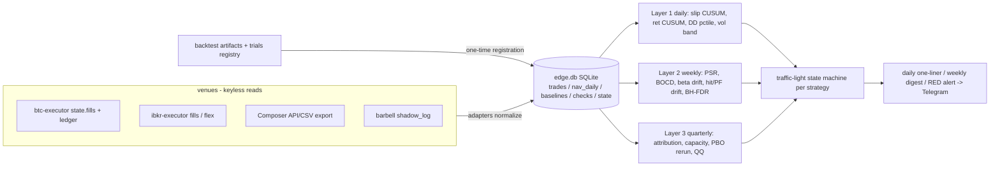

# EDGE-MONITOR — Phase 2: Implementation Blueprint

Keyless, venue-agnostic, SQLite + a nightly cron. Reads engines' data;
never touches orders (separation-of-powers law). Lives in this monorepo at
`edge-monitor/`; deploys beside barbell-lab (same pattern: starter + disk)
or runs in-session on a schedule.

## 1. Architecture



## 2. Canonical schema (every venue adapter writes exactly this)

```sql
strategies(strategy_id TEXT PK, venue TEXT, cadence TEXT,   -- daily|per_trade|monthly
           inception TEXT, baseline_id TEXT, state TEXT DEFAULT 'GREEN',
           size_mult REAL DEFAULT 1.0)
trades(strategy_id, ts_utc, trade_id, side, qty, notional_usd,
       fill_px, model_px, slip_bps,          -- adverse-positive, signed by side
       fees_usd, pnl_usd, PRIMARY KEY(strategy_id, trade_id))
nav_daily(strategy_id, date, nav, ret, gross_exposure,
          PRIMARY KEY(strategy_id, date))
baselines(baseline_id PK, strategy_id, frozen_at,
          json)   -- backtest daily returns ref (file hash), SR/skew/kurt,
                  -- n_trials + sr_std_across_trials (registry or declared),
                  -- dsr, pbo (or 'undefined:penalty_n=20'), mintrl_days,
                  -- cusum {k,h,target_arl}, slip {mean,sd,k,h},
                  -- mc_dd quantile grid by horizon, vol p01/p99 band by 20d
checks(strategy_id, date, layer, metric, value REAL, threshold REAL,
       breach INTEGER, note TEXT)
state_log(strategy_id, ts_utc, from_state, to_state, trigger, note)
```

Adapter notes: btc-executor `state.fills` already carries adverse-signed
slip_bps (built 2026-08); ibkr adapter = fills vs decision price from the
executor's ledger; Composer = daily NAV pull + weekly rules-replication for
timing drift; shadow tracker = monthly, layers 1a (DD) and process checks
only. Missing feed for >2 days = its own YELLOW ("monitoring blind" — the
BARBELL-SHADOW missing-log lesson).

## 3. Monitoring layers — exact checks

**Layer 1 — daily (cron after engines' EOD):**
| check | input | statistic | trigger |
|---|---|---|---|
| slip CUSUM | per-trade slip_bps | CUSUM k=0.5σ_slip, h: ARL≈200 trades | alarm → YELLOW contributor |
| return CUSUM | daily ret, baseline-standardized | k=½·(SR_bt/√252), h: ARL 500d | alarm → YELLOW contributor |
| DD percentile | live NAV vs MC grid | max-DD & underwater pctile, length-matched | ≥95 → YELLOW; ≥99 → RED contributor |
| vol band | 20d realized vol | vs backtest MC p01–p99 | outside → regime flag (contextualizes, never sizes alone) |
| data freshness | all feeds | staleness days | >2d → YELLOW (blind) |

**Layer 2 — weekly:** PSR update (printed only after MinTRL: before that,
output is literally `insufficient: n=63 of 476`); BOCD posterior on
lag-standardized returns (corroborator); rolling 60d beta drift (>2×SE for
20d); hit-rate/PF drift vs baseline with Wilson intervals; **BH-FDR at 10%
across the week's alert p-values** before any state escalation.

**Layer 3 — monthly/quarterly:** regime attribution (canary phase + vol
flags: was underperformance concentrated in flagged regimes? edge-explained
vs regime-explained memo); capacity regression slip~notional; descriptive QQ
+ block-bootstrap KS (labeled descriptive); PBO re-run MANDATORY on any
re-optimized strategy before its new baseline freezes; annual re-freeze
review of baselines (never silent).

## 4. Decision framework — traffic-light state machine

Pre-committed. All transitions logged with the triggering statistic.

| transition | trigger (pre-committed) | action |
|---|---|---|
| GREEN→YELLOW | any: return-CUSUM alarm; slip-CUSUM alarm; DD ≥p95; beta-drift confirmed; feed blind >2d | size_mult ×0.5; daily→per-run review; start 20d clock |
| YELLOW→GREEN | 20 trading days with ALL FEEDS FRESH, all detectors below ½-threshold, no new breach (a blind feed cannot vacuously satisfy this — referee 2026-08-13) | restore size_mult to min(1.0, Kelly clip if past MinTRL, else venue ramp level) |
| YELLOW→RED | any: DD ≥p99; PSR(0)<0.05 post-MinTRL; 2nd independent detector within 30d; slip CUSUM re-alarm after reset | size_mult 0 (halt via engine's own halt path); quarantine ≥4 weeks; written review required. (No p-value correction is computed at this tier — RED triggers are percentile/count rules whose false-RED rate is set by construction, verified in the registration MC.) |
| RED→re-promotion | treated as NEW strategy: fresh baseline, shadow/paper for max(60d, MinTRL of claimed fix) with written rationale; no silent restarts | ramp ladder (0.25→0.5→1.0) like the BTC executor's |

**Kelly-graduated sizing** (between states): `size_mult = clip(2·PSR(0)−1, 0, 1)`
once past MinTRL (PSR 0.5 → 0, PSR ≥0.9 → ~0.8+). Precedence rule (referee
2026-08-13): the state table sets the CAP (GREEN 1.0, YELLOW 0.5, RED 0),
the Kelly clip sets the level within the cap, and pre-MinTRL the venue ramp
replaces the Kelly clip. 'Restore 1.0' never overrides a lower Kelly level.
Rationale: posterior-proportional fractional Kelly; binary kill loses the
option value of a strategy that's merely regime-suppressed.

**False-alarm budget** (back-solved, referee-measured): RED <1 false per
strategy / 3y from DD p99 + dual-confirmation by construction. YELLOW: the
return-CUSUM + DD pair alone ≈ 1.5/yr under null (measured: 0.5 + 0.97);
per-trade books add slip CUSUM (~0.5–1.5/yr at 100–300 trades/yr) plus
beta-drift and feed-blind, so the realistic all-in YELLOW rate is ~2–4/yr
per strategy — the budget line, not 2. Achieved rates are logged to
`checks` at registration and audited before RED is armed.

## 5. Alerting

- **Daily one-liner** (Telegram, existing rate-limited pattern):
  `EDGE ok: 4 GREEN, S4 YELLOW(d12/20, dd p96), all feeds fresh` — one line,
  only state changes get their own message.
- **Weekly digest**: per strategy — state, size_mult, PSR (or
  `insufficient n/N`), DD pctile, slip drift bps, beta drift, days-to-MinTRL;
  plus the BH-FDR summary ("3 nominal breaches, 0 survive FDR").
- **RED alert**: statistic, threshold, pre-committed action taken, what
  would falsify it, next review date. Never more than one RED message per
  strategy per day (rate-limit kind: `edge_red`).

## 6. Small-sample honesty (first-class outputs)

Contract for the layer runner (`layers.py`, to build — of the shipped
modules only `dd_percentile` implements it natively today; `psr`/`cusum`/
`bocd` get wrapped): every check returns one of `{verdict,
insufficient(n, n_needed), undefined}`. N_eff autocorrelation adjustment is
likewise a layer-runner responsibility, not yet in `psr.py`.
Rules: PSR silent until MinTRL (prints countdown); DD needs 5 days; CUSUM
needs 60d of live returns before its alarm can escalate state (before that
it logs only); slippage needs 10 trades; monthly-cadence books get
return-based verdicts on a ~4–5y MinTRL clock (corrected 2026-08-13 — the
first draft said "never/decades" off a 9× MinTRL error; until MinTRL they
get process + DD monitoring only, with the countdown printed); PBO
`undefined:penalty_n=20` when the trial history wasn't kept. "Insufficient" rows appear in the digest — silence is
indistinguishable from health, so it is banned.

## 7. Code

Implemented + gate-tested (13 gates, synthetic injected decay + null
calibration + honesty gates): `src/edge_monitor/psr.py` (PSR/DSR/MinTRL,
skew-kurt corrected), `cusum.py` (state machine + MC-calibrated h),
`dd_percentile.py` (length-matched max-DD + underwater percentiles),
`bocd.py` (NIG Student-t BOCD + lag-standardizer). To build next: `db.py`,
`adapters/{coinbase,ibkr,composer,shadow}.py`, `baseline.py` (registration),
`layers.py`, `statemachine.py`, `report.py` — signatures in module README.

## 8. 90-day rollout

| window | build | first verdicts |
|---|---|---|
| wk 1–2 | schema + coinbase adapter (richest data) + S5 baseline registration (paper-engine backtest + trials count from kelly study) | slippage chart live at ~10 trades |
| wk 3–4 | L1 daily job, calibration MC, **alerts in shadow mode** (log, don't send) to measure empirical false-alarm rate | DD percentile live immediately |
| mo 2 | enable alerts; Composer + shadow-tracker adapters; L2 weekly digest; state machine armed (YELLOW only) | return CUSUM armed after 60 live days |
| mo 3 | ibkr adapter (when executor ships); L3 quarterly template; RED tier armed after false-alarm audit | S5 PSR verdict ETA printed (476 trading days from inception at SR≈1.2 — i.e., ~mid-2028; until then the system says so) |

## 9. Open questions / where judgment stays

- Regime-suppressed vs dead is ultimately a judgment call — the system
  narrows it to a memo, never decides retirement alone (Man AHL practice).
- Baselines from synthetic/backtest data carry their own model risk (GDE
  synthetic TE, paper-engine fill model); baseline re-freeze is annual and
  logged, never silent.
- Cross-strategy capital reallocation (portfolio-level Kelly across books)
  is out of scope v1 — per-strategy scaling only.
- Composer's opaque execution means its "slippage" is inference from NAV
  replication — weakest link, flagged as such in every digest.
