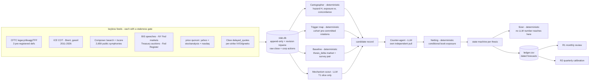

# VARIANT-LAB — implementation blueprint

Keyless, SQLite + a nightly cron, deployed beside barbell-lab (starter + disk).
Reads public feeds and the Composer census; never touches orders. Every ruling in
[`RULINGS.md`](RULINGS.md) is binding on this design.

## 1. Architecture



The load-bearing property: **`CART` and `SIZER` are deterministic and `SCOUT` cannot
reach `SIZER`.** LLM output enters the system as a *candidate with a named mechanism*
and as *ledger rows to be scored*, never as a number in the sizing path.

## 2. Agents — disjoint evidence slices

No persona diversity: prompt-level persona injection was measured to give no
significant advantage over a length-matched control, and same-lineage agents show
pairwise error correlation ρ ≈ 0.70, collapsing ten agents to ~1.4 effective
forecasters. Diversity here comes from **partitioned evidence**, which bought a
measured 12–18% Brier improvement on real prediction-market questions.

| agent | kind | evidence slice (disjoint) | returns nothing when |
|---|---|---|---|
| Cartographer | deterministic | CFTC ×3 defs, ICE COT, FINRA SI, concentration ratios | any feed fails its freshness assert |
| Trigger map | deterministic | Composer trees only (T2) | corpus enumeration drifts > 1% in a pass |
| Baseline | deterministic | SPF, ZQ/dated futures, Treasury curve, Nasdaq consensus | no baseline exists for the instrument |
| Mechanism scout | LLM | BIS + central-bank feeds + NY Fed markets + Treasury + Federal Register (T1 only) | it cannot name a `mechanism_id` **and** a dated public trigger level |
| Counter-agent | LLM | its **own** independent pull of the same primaries | never — it must return a verdict |
| Netting | deterministic | Composer holdings + symphony trees + monorepo state | no declared return proxy `R` |
| Sizer | deterministic | ledger + equity marks only | mechanism absent, or drawdown governor tripped |

`SCOUT`'s output contract is a closed enum, not prose:
`{mechanism_id ∈ FORCED_FLOW_ENUM, trigger_level, trigger_date, is_public, source_doc_id}`.
No free-text rationale enters any downstream computation. Critic-to-generator narrative
feedback is forbidden — the counter-agent verifies, it does not coach.

## 3. Schema

```sql
-- append-only. Never UPDATE. barbell-lab's upsert_prices does
-- ON CONFLICT DO UPDATE SET close_adj=... today and silently overwrites history:
-- do NOT copy it. Store raw close + corporate actions, derive adjusted at read.
prices_raw(symbol, date, open, high, low, close, volume, source, pulled_at,
           PRIMARY KEY(symbol, date, source))
corp_actions(symbol, ex_date, kind, value, first_seen_at)   -- split | dividend
positioning(market, report_date, release_ts, definition, net, oi, pct_oi,
            conc_net_4, conc_net_8, spreading, n_traders, source, content_sha256,
            PRIMARY KEY(market, report_date, definition, source))
cohort_conditions(symphony_sid, node_id, ticker, indicator, window_days,
                  comparator, threshold, ancestor_chain, is_ungated, seen_at)
retrieved_docs(doc_id PK, source_host, url, retrieved_at, published_at_claimed,
               published_at_authoritative, first_seen_at, content_sha256,
               trust_class, taint)
candidates(cand_id PK, created_at, instrument, return_proxy,
           mechanism_id, trigger_level, trigger_date, trigger_is_public,
           hazard_p, hazard_horizon_m, hazard_threshold_pct,
           exposure_w, hedge_budget, concordance_class,
           thesis_delta_market, thesis_delta_survey, sign_agreement,
           carry_construction, netting_verdict, state)
ledger(row_id PK, cand_id, opened_on, horizon_date, primitive, forecast_p,
       base_rate_at_intake, base_rate_n, base_rate_window,
       resolved_on, outcome, brier, cluster_id, n_eff_note, status)
state_log(cand_id, ts_utc, from_state, to_state, trigger, note)
```

Ledger grain is **one row per (contract, side, episode_start)**, with monthly
re-affirmation *appended to the row* rather than creating new rows. Per-leg grain
inflates n by 57% with zero information; monthly re-affirmation rows are the
write-only-ledger failure in a new costume (144 rows/yr collapsing to the same ~35
effective observations).

## 4. Feeds — verified, with their traps

| feed | cadence | lag | trap found live |
|---|---|---|---|
| CFTC Socrata ×3 | weekly | **exactly 3 days**, keyed off Friday 15:30 ET release | contract rename 2022-02-08 hit 36 contracts; 2008-07-18 reclassification rewrote 54 weeks of energy history, unrecoverable |
| ICE COT | weekly | — | undocumented but keyless, 2011–2026, covers Brent/gasoil which CFTC does not; **no keyless price series exists for gasoil to score it against** |
| Composer | on demand | — | 52-column schema has **no AUM/popularity/investor field**; offset pagination over a mutating index drops ~10 of 2,659 per pass |
| BIS speeches | daily | median 5d, p90 27d | post-hoc explanation corpus, not an event feed: +1d to detect capitulation, +23d to detect defence |
| NY Fed markets API | same-day | 0 | best find of the pass — SRF ops same-day, FX swaps to 2010, SOMA weekly to 2003 |
| Treasury auctions | forward | announced 2–7d ahead | 7,680 auctions from 1979; a genuine forward calendar |
| Federal Register | daily | forward `effective_on` | dated mandate changes from 1994 |
| Cboe delayed quotes | daily | T+1 | per-strike IV/OI/greeks to 840 days, keyless — but **no surface history exists at any price**, so the detector cannot be backtested |
| Price quorum | daily | T+1 | Yahoo under blanket robots Disallow and has killed 2 of 3 endpoints; its 429 is a UA blocklist, not a rate limit, so a backoff loop hangs forever |

**Dead or trapped, do not wire:** Cboe put/call CSVs (HTTP 200, last row 2019-10-04),
OCC volume-totals (byte-identical MD5 across four different `report_date` values),
CME (403 with explicit anti-scraping ToU on all six paths), Stooq (JS proof-of-work
behind a 200), GDELT (6/6 failures), AAII/ICI/NAAIM/Conference Board (no free
machine-readable series). FRED failed 8/8 this session and must be re-probed from the
Render network before anything depends on it.

`CL=F` and friends are **level-only symbols**: the continuous splice printed +21.4%
over 20 years against the −76.2% an actual USO holder earned. Never compute a return
from a `=F` series.

### Staleness gates (merge-blocking, both required)

```python
assert max(feed.dates) >= today - MAX_STALE_DAYS[feed.name]     # catches the 2019 freeze
assert len({sha256(feed.fetch(d)) for d in distinct_dates}) > 1  # catches the ignored date param
```
A 200 response with well-formed content is **no evidence of freshness whatsoever**.

## 5. State machine

Mirrors treasury-canary's re-steepening machine and adopts barbell-lab's
`edge/statemachine.py` check contract, so a blind or stale feed automatically halves
size rather than being ignored.

| transition | pre-committed trigger | action |
|---|---|---|
| WATCH → CANDIDATE | mechanism named with a dated public trigger level | open a ledger row; size 0 |
| CANDIDATE → PROBE | counter-agent verdict returned; netting passes; `sign_agreement` true | starter = `c_max`/3 |
| PROBE → RUNG k | exogenous pre-registered predicate k true **AND** mechanism live **AND** equity DD < 20% **AND** ≥ 21 trading days since rung k−1 | add, denominated as a fraction of *current* equity |
| any → TRIM | `TREND_t` false or `RUNUP_t` ≥ 100% | m → 1.0 at next open. A **size reduction, not an exit** |
| any → GOVERNOR | equity DD ≥ 20% from running peak | collapse to starter within one mark; freeze ladder until a new trigger fires from a fresh equity peak |
| any → BLIND | any feed fails its freshness assert | size ×0.5, and the recovery clock cannot be satisfied by a blind feed |
| any → CLOSED | mechanism's trigger date passes without firing, or invalidation predicate true | flat; resolve the ledger row |

Escalation fires on an **exogenous** predicate computed from data that is not the
position's own mark. Realized P&L enters in exactly one direction — as the
de-escalation governor. Adds that happen to land into adverse price are permitted only
as a consequence of the predicate, never as their own trigger; adds landing into
favourable price get no preference of any kind. A rule that only ever adds to winners
is a momentum overlay wearing a different name and inherits momentum's crash profile;
a rule that adds to losers is a martingale.

## 6. Sizing

```
c_max   = 2 / (1 + ln p / ln(1 - d))        # p = P(drawdown ≥ d), both declared by Casey
starter = c_max / 3
m_t     = m_mechanism × 1{TREND_t} × 1{RUNUP_t < 1.00}      # price may only subtract
```

At the declared default (p = 0.10, d = 0.30): `c_max` = 0.268, starter = 0.089,
retaining 46.5% of maximum log growth. The cap is non-negotiable because c = 1.5 and
c = 0.5 give **identical 75% of maximum growth but 0.794 versus 0.125 probability of
ever drawing down 50%**. Full Kelly loses money on 12.4% of 700-bet paths even with a
genuine 14% edge on every bet.

Reuse `btc-paper-engine/backend/app/engine/kelly.py` verbatim, including the
stationary-block-bootstrap shrinkage envelope and the >25%-of-resamples-non-positive
kill rule — applied to the **escalated** size, not only the initial size.

Then divide by measured `N_eff` from the netting step (HHI over the correlation-matrix
eigenvalues of book + thesis), which measured **4.17 of 54 instruments** at 1y — not 1.

**Proof that no LLM number reaches the sizer:** `SIZER` takes `(mechanism_id,
predicate_bool, equity_marks, c_max, N_eff, w)`. Every one is deterministic or
declared by Casey. The static gate `grep -E "(direction|side|sign|size)\s*=.*(crowd|
zscore|percentile|agent_|llm_|confidence)"` over `engine/` must return nothing.

## 7. Netting — the are-we-the-crowd check

Runs nightly, before any recommendation is printed.

1. Every thesis declares a tradeable return proxy `R`. **No proxy, no size, no exception.**
2. Regress `R` on six factor proxies (SMH, SPY, TLT, XBI, VIXY, GLD) over 1y **and** 3y;
   if any loading flips sign between windows, mark UNSTABLE and halve the cap.
3. Compute book exposure `B_f` **conditionally**: replay each symphony's weight history
   at today's dollar values, then take the median over days where the thesis's *own*
   entry trigger was true. Never from today's snapshot — that reads −6% SPY beta at the
   30th percentile of its own history and understates real exposure by ~144pp of book.
4. **Reject** when `sign(size × beta(R,f)) == sign(B_f_conditional)` and
   `|B_f_conditional| > 0.5 × book` on the dominant factor.
5. Otherwise shrink by `1 − |corr(R, book)|`, on top of the Kelly ceiling.
6. Print Casey's overlap with the cohort's 78–82 / 29–32 trigger bands beside every
   recommendation.

## 8. Merge-blocking gate tests

1. `test_no_direction_without_mechanism` — replay the 4,649 |z| ≥ 2.0 market-weeks with
   `mechanisms=[]`; assert every `direction == 0`, both signs unreachable, and no static
   code path from a crowding value to a sign.
2. `test_price_gate_is_boolean` — assert the price gate returns `bool`, never a score,
   and that `m_t ≤ m_mechanism` for every input.
3. `test_carry_never_joined` — every candidate declares `carry_construction`; assert no
   CARRY candidate ever receives JOIN/ADD/SCALE_UP from any input, at any percentile.
4. `test_feed_freshness` and `test_feed_varies` — both assertions, every feed.
5. `test_no_llm_number_in_sizer` — signature check plus the static grep.
6. `test_untrusted_text_cannot_size` — run the pipeline over a corpus with planted
   injection strings; assert no thesis, no size change, no ledger row.
7. `test_dark_venues_display_no_coverage` — any theme whose exposure lives in LDI,
   structured products, private credit or TRS must render "no positioning coverage",
   never a benign score. The 2022 gilt/LDI unwind had *zero* public positioning warning
   and near-zero speech-corpus warning; Feb 2018 short-vol read the 55th–71st COT
   percentile the week before it blew up.
8. `test_revision_tripwire` — a retroactive change to a stored positioning row fails the
   build; a price `adjclose` delta explainable by a newly-observed corporate action does
   **not** (a naive port jams the system in a permanent un-clearable YELLOW within days).
9. `test_honesty_box_pinned` — `HONESTY_BOX["pooled_fade_z2_4w_demeaned_pct"] ≈ 0.031`,
   `["pooled_fade_t"] ≈ 0.38`. If the code's numbers drift from the published ones, fail.
10. `test_crowding_stamped_unweighted` — every emitted crowding number carries
    `"unweighted by dollars, n=X"`.

## 9. Benchmark and kill criteria

**Primary benchmark is the exposure-matched paired null**: the identical book,
instruments and dates, with the crowding overlay replaced by a *random* overlay of the
same duty cycle and trim depth, permuted ≥ 10,000 times. The reported statistic is the
empirical p-value of the observed delta. Buy-and-hold, 60/40 and the barbell are
context rows and may never be the pass/fail comparator. Follow-the-trend on the same
instrument and horizon is a mandatory secondary gate on directional emissions: a
directional call that does not beat trend is logged as trend re-packaging and does not ship.

**Calibration null** is the frozen, universe-specific unconditional base rate computed
once on data ending strictly before ledger inception, stamped with its n and window.
The published 11%/14%/20%/24% figures may not be used as the null.

**T+36 bar**, and no significance-based skill gate is permitted because none is
reachable at 35.3 independent episodes/year: point-estimate BSS ≥ 0 against the frozen
base rate, printed with its block-bootstrap CI and the literal stamp *"not
statistically distinguishable from the constant"*, plus calibration-in-the-large
|mean forecast − realized frequency| ≤ 18.6pp. Every BSS ships with `N_eff` from a
36-month calendar-block bootstrap, never a raw row count.

The R1 monthly and R2 quarterly Routines are written **in the same commit as the first
ledger row**, or the build fails. `venture-deal-analyzer/ledger.csv` has 6 rows and 0
resolved outcomes because the closing Routines were never created; that is the default
outcome of this kind of project unless the closing loop ships with the writing loop.

## 10. Build order

Each stage must prove something before the next is built.

1. **Persistence + feeds + staleness gates.** Proves: 14/14 gates pass live, the
   revision tripwire fires on a planted retroactive edit and stays quiet on a dividend.
2. **Cartographer + hazard ledger + R1/R2 Routines.** Proves: rows are written *and*
   resolve automatically. Nothing else is built until a row has closed by itself.
3. **Composer census + trigger map.** Proves: the cohort's ungated share is reproducible
   night over night within the ~10-symphony pagination drift.
4. **Mechanism scout + counter-agent.** Proves: the scout returns nothing on ≥ 60% of
   candidates. A scout that always finds a mechanism has learned to fabricate them.
5. **Netting.** Proves: the conditional exposure replay reproduces the +201%/−190%
   figures on known dates.
6. **Sizer.** Built last, wired to nothing, and only after the ledger has scored
   forecasts. Paper first, per the house staged-rollout law.

Do not build stage n+1 while stage n's proof is outstanding.
